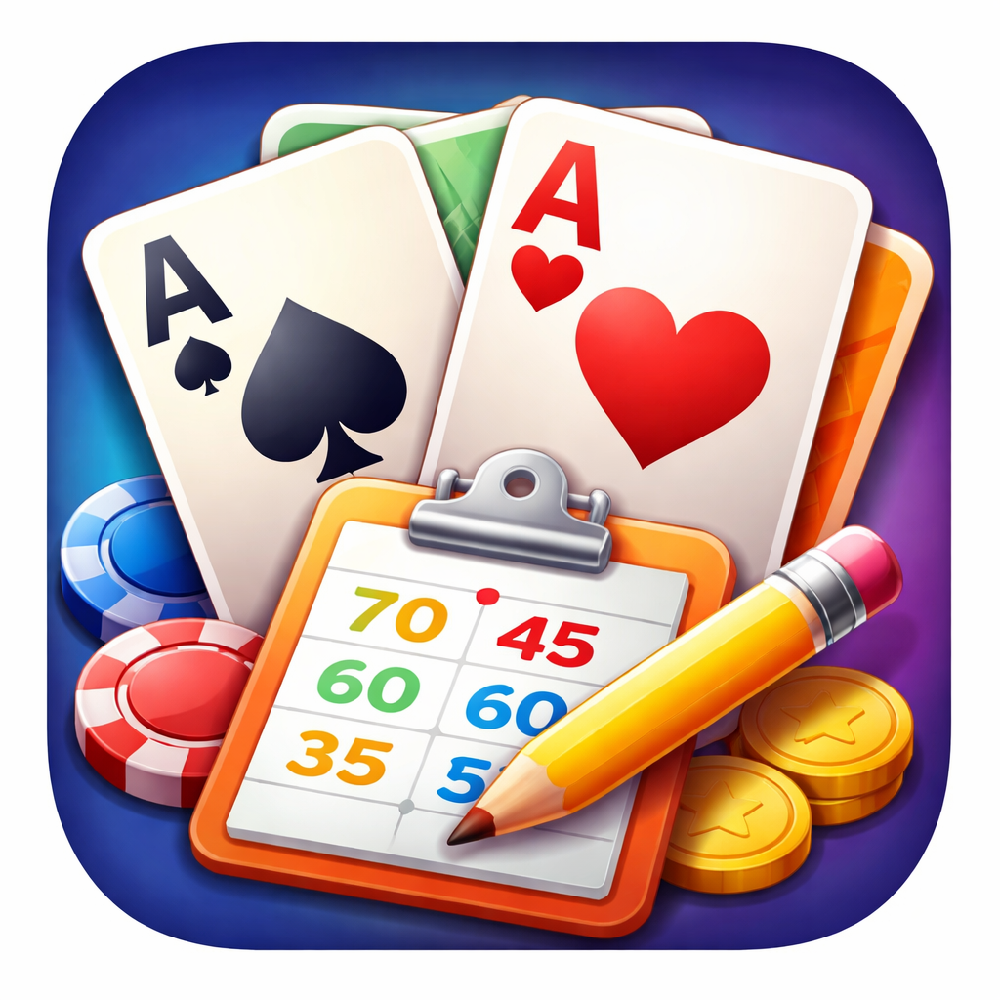

<p align="center">
  
</p>

<h1 align="center">Bugger It Scorer</h1>

<p align="center">
  A native iOS scorer for the card game <strong>Up / Down the River</strong>
</p>

<p align="center">
  
  
  
  
  
</p>

---

## About

**Bugger It Scorer** takes the paper-and-pen drudgery out of tracking scores for Up / Down the River — a trick-taking card game where players bid on how many tricks they'll win each round. The app enforces house rules, validates bids in real time, and charts each player's progress across the full game arc.

---

## The Game in 30 Seconds

> *"The goal is not to win the most tricks — it's to predict exactly how many you'll win."*

- **3–8 players**, standard 52-card deck, Ace high
- Rounds go **up** (1 card, 2 cards, … max) then **back down** to 1
- Each player bids how many tricks they expect to win
- Score big for accuracy; lose points for every trick you're off

---

## Scoring

| Outcome | Points |
|---|---|
| Bid 0 and take 0 | **+10** |
| Bid *n* ≥ 1 and make it exactly | **+50 + (10 × n)** |
| Miss by *d* tricks | **−10 × d** |

```
Bid 1 → make it → +60 pts
Bid 3 → make it → +80 pts
Bid 3 → take 1  → −20 pts
Bid 3 → take 4  → −10 pts
```

---

## Features

- **Live bid validation** — real-time feedback as players enter bids; dealer forbidden-bid rule enforced automatically
- **Automatic dealer rotation** — tracks who deals each round
- **Round navigator** — jump to any past round to review or correct scores
- **Score charts** — cumulative score progression and rank-over-time charts (Swift Charts)
- **Configurable variants** — toggle dealer restriction, reserve trump card, and set a custom max hand size at game start
- **Multiple concurrent games** — SwiftData persistence keeps every game intact
- **How to Play** — full in-app rules reference with table of contents

---

## Game Options

| Option | Default | Effect |
|---|---|---|
| Dealer Forbidden Bid | **On** | Dealer may not bid a value that makes total bids = cards dealt (guarantees someone misses) |
| Reserve Trump Card | **On** | Reserves 1 card for trump reveal; reduces max hand size by 1 |
| Maximum Hand Size | Automatic | Override the calculated max (1 – deck ÷ players) |

---

## Architecture

```
Models (SwiftData @Model)
    ↓
ViewModels (@MainActor ObservableObject)
    ↓
Views (SwiftUI)
```

```
Game  (aggregate root)
├── [Player]     sorted by sortIndex
└── [Round]      one per hand in the sequence
     └── [RoundEntry]  bid + tricks for each player
```

Business logic lives in three stateless types — no singletons, no global state:

| Type | Responsibility |
|---|---|
| `Rules` | Scoring formula, bid/trick validation, round sequence |
| `ScoringEngine` | Cumulative totals across all rounds |
| `RoundValidator` | User-facing validation messages wrapping `Rules` |

---

## Tech Stack

- **Language:** Swift 5.9
- **UI:** SwiftUI
- **Persistence:** SwiftData (SQLite-backed)
- **Charts:** Swift Charts (native)
- **Min deployment:** iOS 17
- **Dependencies:** None — zero third-party packages

---

## Project Structure

```
UpDownRiverScorer/
├── Models/
│   ├── Game.swift
│   ├── Game+Colors.swift
│   ├── Game+Completion.swift
│   ├── Player.swift
│   ├── Round.swift
│   └── RoundEntry.swift
├── ViewModels/
│   ├── NewGameViewModel.swift
│   └── RoundEditorViewModel.swift
├── Views/
│   ├── GameListView.swift
│   ├── GameDetailView.swift
│   ├── RoundEditorView.swift
│   ├── NewGameView.swift
│   ├── RankProgressionView.swift
│   ├── OverallScoreProgressView.swift
│   └── HowToPlayView.swift
└── Logic/
    ├── Rules.swift
    ├── ScoringEngine.swift
    └── RoundValidator.swift
```

---

## Building

1. Clone the repo
2. Open `UpDownRiverScorer.xcodeproj` in Xcode 15+
3. Select a simulator or device running iOS 17+
4. **Cmd+R** to run — no package resolution needed

Tests: **Cmd+U** (Swift Testing framework)

---

## Privacy

No data leaves your device. No analytics, no tracking, no network requests. See [PRIVACY.md](PRIVACY.md).

---

*Ship small. Ship often. Keep learning.*
